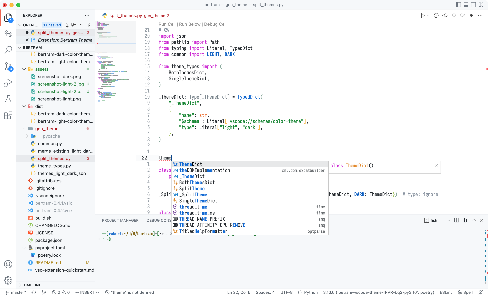
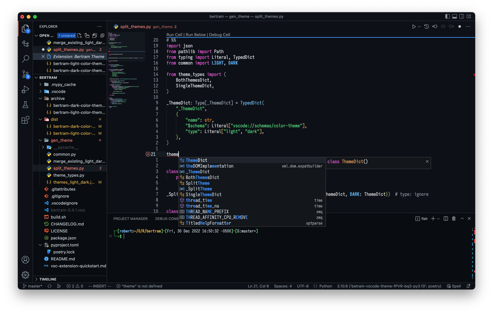

= Bertram VSCode Theme
:nofooter:

++++

++++

A Github-based theme with a bit more color.
Most theme values were copied from https://marketplace.visualstudio.com/items?itemName=GitHub.github-vscode-theme[GitHub Theme].

== Screenshots

File icon theme: https://marketplace.visualstudio.com/items?itemName=PKief.material-icon-theme[Material Icon Theme]

=== Light Theme

[.shadow-img.light,link=assets/screenshot-light.png]

=== Dark Theme

[.shadow-img.dark,link=assets/screenshot-dark.png]

