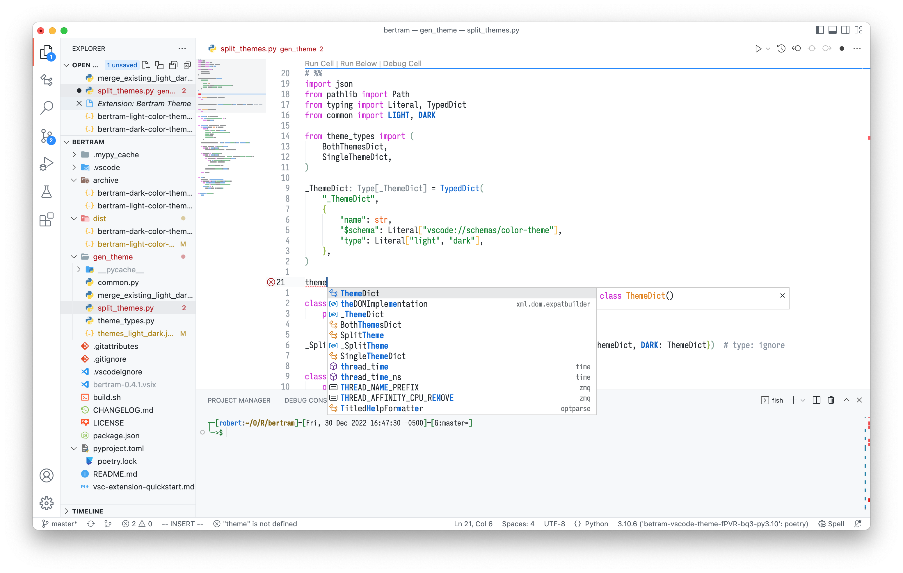

# Bertram Theme

A GitHub-based theme with a bit more color.

Most theme values were shamelessly copied from [GitHub Theme](https://marketplace.visualstudio.com/items?itemName=GitHub.github-vscode-theme).

## Screenshots

File icon theme: [Material Icon Theme](https://marketplace.visualstudio.com/items?itemName=PKief.material-icon-theme)

### Light Theme

### Dark Theme

